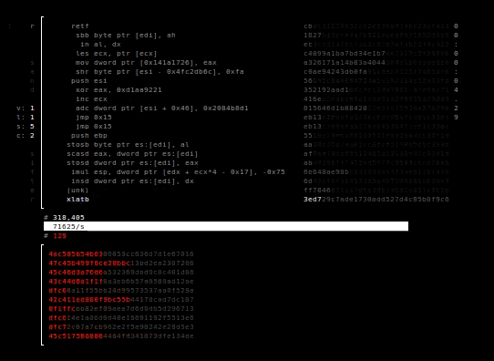
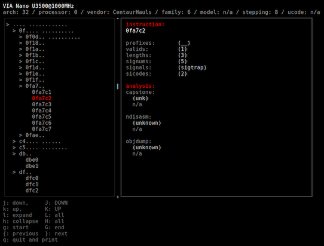

## s a n d s i f t e r 
: the x86 processor fuzzer

### Overview

The sandsifter audits x86 processors for hidden instructions and hardware bugs,
by systematically generating machine code to search through a processor's
instruction set, and monitoring execution for anomalies. Sandsifter has
uncovered secret processor instructions from every major vendor; ubiquitous
software bugs in disassemblers, assemblers, and emulators; flaws in enterprise
hypervisors; and both benign and security-critical hardware bugs in x86 chips.

With the multitude of x86 processors in existence, the goal of the tool is to
enable users to check their own systems for hidden instructions and bugs.

To run a basic audit against your processor:

```
sudo ./sifter.py --unk --dis --len --sync --tick -- -P1 -t
```



The computer is systematically scanned for anomalous instructions.  In the upper
half, you can view the instructions that the sandsifter is currently testing on
the processor.  In the bottom half, the sandsifter reports anomalies it finds.

The search will take from a few hours to a few days, depending on the speed of
and complexity of your processor.  When it is complete, summarize the results:

```
./summarize.py data/log
```



Typically, several million undocumented instructions on your processor will be
found, but these generally fall into a small number of different groups.  After
binning the anomalies, the summarize tool attempts to assign each instruction to
an issue category:

* Software bug (for example, a bug in your hypervisor or disassembler),
* Hardware bug (a bug in your CPU), or
* Undocumented instruction (an instruction that exists in the processor, but is
  not acknowledged by the manufacturer)

Press 'Q' to quit and obtain a text based summary of the system scan:

The results of a scan can sometimes be difficult for the tools to automatically
classify, and may require manual analysis. For help analyzing your results, feel
free to send the ./data/log file to xoreaxeaxeax@gmail.com.  No personal
information, other than the processor make, model, and revision (from
/proc/cpuinfo) are included in this log.


### Results

Scanning with the sandsifter has uncovered undocumented processor features
across dozens of opcode categories, flaws in enterprise hypervisors, bugs in
nearly every major disassembly and emulation tool, and critical hardware bugs
opening security vulnerabilities in the processor itself.

Details of the results can be found in the project 
[whitepaper](./references/domas_breaking_the_x86_isa_wp.pdf).


### Building

Sandsifter requires first installing the Capstone disassembler:
http://www.capstone-engine.org/

Sandsifter can be built with:

```
make
```

and is then run with 

```
sudo ./sifter.py --unk --dis --len --sync --tick -- -P1 -t
```

### Flags

Flags are passed to the sifter with --flag, and to the injector with -- -f.

Example:

```
sudo ./sifter.py --unk --dis --len --sync --tick -- -P1 -t
```

Sifter flags:

--len - 
	search for length differences in all instructions (instructions that
	executed differently than the disassembler expected, or did not
	exist when the disassembler expected them to

--dis - 
	search for length differences in valid instructions (instructions that
	executed differently than the disassembler expected)

--unk - 
	search for unknown instructions (instructions that the disassembler doesn't
	know about but successfully execute)

--ill - 
	the inverse of --unk, search for invalid disassemblies (instructions that do
	not successfully execute but that the disassembler acknowledges)

--tick - 
	periodically write the current instruction to disk

--save - 
	save search progress on exit

--resume - 
	resume search from last saved state

--sync - 
	write search results to disk as they are found

--low-mem - 
	do not store results in memory

Injector flags:

-b -
	mode: brute force

-r -
	mode: randomized fuzzing

-t -
	mode: tunneled fuzzing

-d -
	mode: externally directed fuzzing

-R -
	raw output mode

-T -
	text output mode

-x -
	write periodic progress to stderr

-0 -
	allow null dereference (requires sudo)

-D -
	allow duplicate prefixes

-N -
	no nx bit support

-s seed -
	in random search, seed value

-B brute_depth -
	in brute search, maximum search depth

-P max_prefix -
	maximum number of prefixes to search

-i instruction -
	instruction at which to start search (inclusive)

-e instruction -
	instruction at which to end search (exclusive)

-c core -
	core on which to perform search

-X blacklist -
	blacklist the specified instruction

-j jobs -
	number of simultaneous jobs to run

-l range_bytes -
	number of base instruction bytes in each sub range


### Keys

m: Mode - change the search mode (brute force, random, or tunnel) for the sifter

q: Quit - exit the sifter

p: Pause - pause or unpause the search


### sudo

For best results, the tool should be run as the root user.  This is necessary so
that the process can map into memory a page at address 0, which requires root
permissions.  This page prevents many instructions from segfaulting on memory
accesses, which allows a more accurate fault analysis.


### Legacy systems

For scanning much older systems (i586 class processors, low memory systems),
pass the --low-mem flag to the sifter and the -N flag to the injector:

```
sudo ./sifter.py --unk --dis --len --sync --tick --low-mem -- -P1 -t -N
```

If you observe your scans completing too quickly (for example, a scan completes
in seconds), it is typically because these flags are required for the processor
you are scanning.


### README TODO

* algorithms: random tunneling brute driven/mutator
* detailed results enumeration
* screenshots of bug types, final results
* grep ./injector
* 32 and 64 bit installs
* prefixes and limitations
* installing capstone help
* terminal colors (export TERM='xterm-256color')
* shrink screen to fit
* example of targetted fuzzing


### References

* A whitepaper describing the approach is 
  [here](./references/domas_breaking_the_x86_isa_wp.pdf).
* Slides from the Black Hat 2017 presentation are
  [here](./references/domas_breaking_the_x86_isa.pdf)
